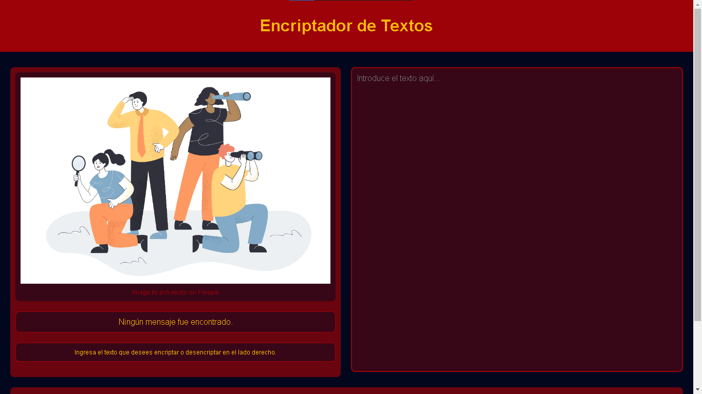
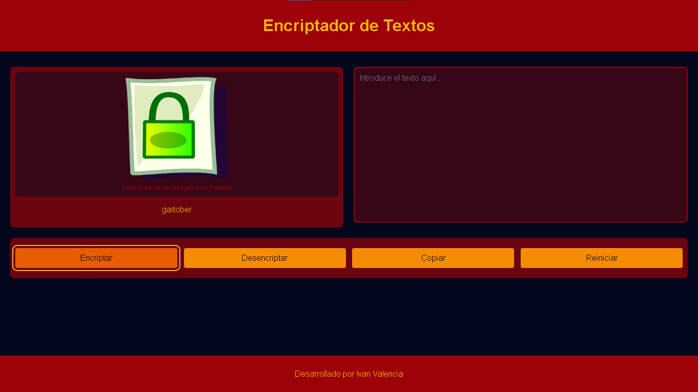
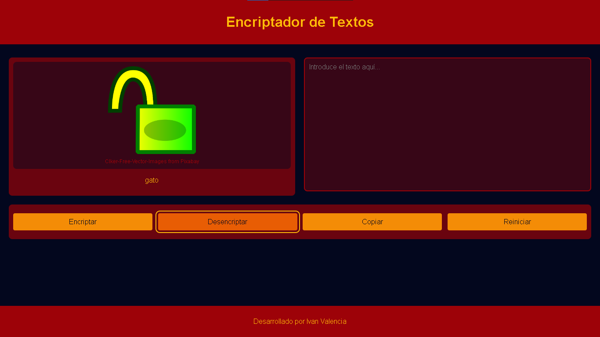

# Text Encryptor 🛡️

Bienvenido a **Text Encryptor**, una aplicación web sencilla que permite encriptar y desencriptar texto usando JavaScript, HTML y CSS. Esta herramienta es ideal para aquellos que desean aprender sobre las técnicas básicas de encriptación y desencriptación mientras practican sus habilidades de desarrollo web.

## Descripción 📖

**Text Encryptor** convierte texto de entrada en una versión encriptada utilizando reglas específicas. También puede revertir el texto encriptado a su forma original. Esta aplicación se desarrolló como un primer proyecto para familiarizarse con tecnologías web fundamentales.

## Características ⭐

- **🔐 Encriptar Texto**: Convierte tu texto en una versión segura y encriptada.
- **🔓 Desencriptar Texto**: Restaura el texto encriptado a su forma original.
- **📋 Copiar Texto**: Copia el texto encriptado o desencriptado al portapapeles con un solo clic.
- **🖥️ Interfaz Sencilla**: Diseño intuitivo y fácil de usar.

## Uso

1. **Introducir Texto**: Escribe el texto que deseas encriptar o desencriptar en el área de texto.
2. **Seleccionar Acción**: Haz clic en "Encriptar" para convertir el texto a su versión encriptada o en "Desencriptar" para revertir el texto encriptado.
3. **Copiar**: Usa el botón "Copiar" para copiar el resultado al portapapeles.
4. **Reiniciar**: Limpia todos los campos y vuelve al estado inicial con el botón "Reiniciar".

## Capturas de Pantalla 📸

Aquí se pueden incluir algunas capturas de pantalla para mostrar la interfaz de la aplicación y cómo funciona.

### Interfaz en el menú principal

### Interfaz de Encriptación

### Interfaz de Desencriptación

## Tecnologías Utilizadas 🔧

- **HTML**
- **CSS**
- **JavaScript**

## Contribuciones 🤝

Las contribuciones son bienvenidas. Siéntete libre de hacer un fork de este repositorio y enviar pull requests. Si encuentras algún problema o tienes sugerencias para mejorar la aplicación, no dudes en abrir un **issue** en el repositorio. Esto permitirá a otros usuarios y colaboradores conocer y discutir sobre posibles mejoras o errores.

Para contribuir, sigue estos pasos:

1. **Fork**: Clona el repositorio en tu cuenta de GitHub.
2. **Crea una Rama**: Crea una nueva rama para tus cambios.
3. **Realiza tus Cambios**: Haz las modificaciones necesarias.
4. **Envía un Pull Request**: Envía un pull request para que revise tus cambios.

¡Apreciaría tu interés en mejorar el proyecto y tu tiempo para contribuir!

## Licencia 📜

Este proyecto está licenciado bajo la [Licencia MIT](LICENSE). Para más detalles, consulta el archivo `LICENSE` en el repositorio.

---

¡Gracias por usar Text Encryptor! Espero que encuentres útil esta herramienta. No dudes en compartir tus comentarios y sugerencias.
